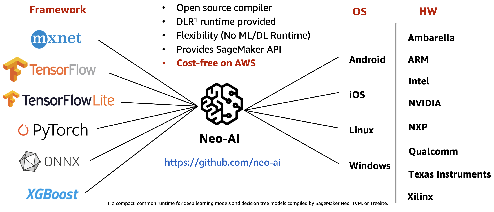
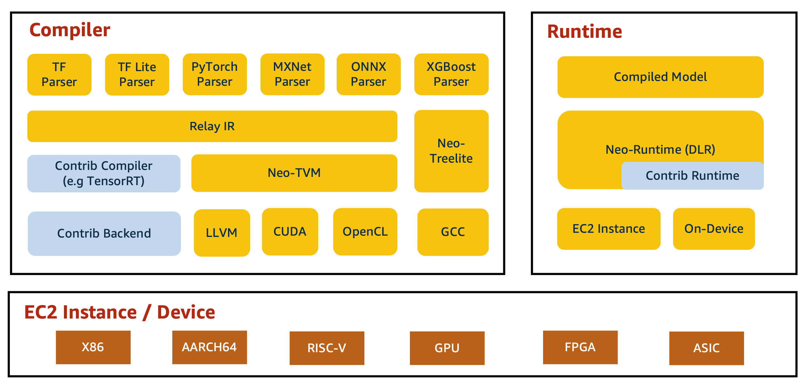

# Model Compilation using SageMaker Neo

## Neo-AI
Neo-AI는 다양한 머신 러닝 프레임워크를 지원하며 정확도 손실을 최소화하면서 자동으로 모델을 최적화합니다. Neo-AI 컴파일러는 타겟 디바이스의 OS 및 하드웨어 플랫폼에 맞게 모델을 자동으로 최적화하고 딥러닝 런타임에서 모델을 실행 가능한 형태로 변환합니다. 딥러닝 런타임은 머신 러닝 프레임워크와 엣지 디바이스에 상관없이 단 두 줄의 코드로 추론을 수행할 수 있으며 런타임ㅁ 버전은 지속적으로 업데이트됩니다.

그리고 AWS 계정이 있다면 Neo-AI 기반의 관리형 서비스인 Amazon SageMaker Neo를 사용할 수 있습니다. SageMaker Neo는 간단한 API 호출이나 UI로 추가 패키지나 인프라 설정 및 요금 부과 없이 동시에 여러 타켓 디바이스들에 적합한 모델을 컴파일할 수 있습니다.


<br>

## SageMaker Neo Stack
SageMaker Neo Stack을 자세히 살펴보겠습니다. SageMaker Neo는 먼저 컴파일러로 모델을 최적화한 다음, 클라우드 또는 온디바이스에서 런타임을 통해 컴파일된 모델을 실행합니다.



### Compiler
컴파일러의 경우, 연산 그래프(computational graph) 제너레이터는 다양한 딥러닝 플랫폼에서 훈련된 딥러닝 모델을 로드하여 그래프 구조로 재구성합니다. 그런 다음, 모델에 정의된 연산자를 기본 연산자로 변환하여 계산 그래프를 생성합니다. 그래프 생성 후, 다양한 그래프 최적화 기법을 적용하여 최적화된 그래프를 생성합니다.

그러나, 모델이 작동할 타겟 하드웨어 아키텍처를 고려한 하드웨어 종속 최적화는 최적화된 그래프만으로는 불가능합니다. 따라서, 연산 그래프를 하드웨어 의존적 최적화의 한 형태인 IR(Intermediate Representation)로 변환할 필요가 있습니다. Relay IR은 생성된 IR을 기반으로 메모리 할당, 병렬화 및 실행 순서와 같은 하드웨어 종속 최적화를 수행한 후 코드를 생성합니다. 자세한 사항은 Relay IR 논문(https://arxiv.org/pdf/1810.00952.pdf)을 참조하세요.

Apache TVM이 항상 사용되는 것은 아닙니다. 딥러닝 프레임워크나 하드웨어 사양에 따라 TensorRT나 TreeLite를 사용합니다. NVIDIA GPU의 경우 Neo는 TensorRT를 사용합니다.

마지막으로, 백엔드 코드 생성기는 IR을 기반으로 딥러닝 모델 워크로드가 배포되는 대상 하드웨어 아키텍처(CPU, GPU, TPU 등)에 최적화된 백엔드 코드를 생성합니다.

### DLR(Deep Learning Runtime)
런타임 부분은 DLR(Deep Learning Runtime)을 통해 수행됩니다. DLR은 SageMaker Neo로 컴파일된 모델로 추론을 수행하기 위한 런타임입니다. 내부적으로는 타겟 하드웨어와 모델에 따라 TVM 런타임, Treelite 런타임, NVIDIA TensorRT를 사용하며, 다양한 디바이스에서 컴파일된 모델을 로드하고 실행하기 위한 통합 Python/C++ API를 제공합니다. 

Neo-AI로 컴파일한 모델은 DLR(Deep Learning Runtime)을 설치하시면 두 줄의 코드만으로 타겟 디바이스에서 쉽게 추론할 수 있습니다. X86-64기반 CPU는 컴파일 없이 곧바로 `pip install`로 설치 가능하고 NVIDIA jetson nano의 경우에도 jetpack 4.2에서 4.4까지의 wheel 패키지를 제공하고 있습니다. 

```python
import dlr
import numpy as np

# Load model 
model = dlr.DLRModel(“[YOUR-MODEL-PATH]”, “cpu or gpu”)
x = np.random.rand(1, 3, 224, 224)
# Inference
y = model.run(x)
```

#### DLR 모델 디렉토리 구조
1. `compiled.params` & `compiled.so`: SageMaker Neo로 컴파일된 모델을 추론하기 위한 모델 파라메터와 런타임입니다.
2. `compiled.meta`: `compiled.meta`는 SageMaker 모델 컴파일 설정값들에 대한 정보들을 담고 있습니다.
(Target platform, target architecture, cpu/gpu, 컴파일 시간, input shape, output shape)
이 파일이 DLR 추론에 직접적으로 사용되는 것이 아니라, input/output shape이 기억나지 않거나 SageMaker Neo 컴파일 정보가 필요할 때 참조합니다.
3. `compiled_model.json`: 컴파일된 모델 계산 그래프에 대한 파라메터입니다. 특정 op에 num_inputs, num_outputs 등을 확인할 수 있으며, 어떤 컴파일러가 사용되었는지 알 수 있습니다. 참고로, SageMaker Neo는 단일 컴파일러가 아니라 타겟 디바이스/플랫폼에 따라 다른 컴파일러를 사용합니다. 예를 들어 NVIDIA GPU를 사용하는 타겟 디바이스 (예: p2/p3 instance, NVIDIA Jetson nano/xavier)는 내부적으로 TensorRT를 사용하며, 일반적인 경우에는 Apache TVM을 사용합니다. 그리고 NVIDIA GPU 디바이스를 사용하더라도 GPU on/off에 따라 컴파일러 설정이 변경됩니다. (GPU on: TensorRT, GPU off: TVM)
4. `libdlr.so` & `dlr.h`: `libdlr.so`와 `dlr.h`는 DLR(Deep Learning Library)의 번들 런타임으로 DLR이 로컬 디바이스에 이미 설치되었다면 반드시 필요하진 않습니다.
시스템에 설치된 `libdlr.so`와 `dlr.h`를 참조하려면 `use_default_dlr=True`로 부여하시면 됩니다.
(`model = dlr.DLRModel("[YOUR-MODEL-PATH]", "gpu", use_default_dlr=True)` SageMaker Neo는 타겟 디바이스에 최적화하여 모델을 컴파일하기 위해 계산 그래프를 IR(Intermediate Representation)로 변환합니다. Relay IR은 생성된 IR을 기반으로 메모리 할당, 병렬화, 실행 순서와 같은 하드웨어 종속 최적화를 수행하는 역할을 합니다. 이에 대한 자세한 내용은 https://arxiv.org/pdf/1810.00952.pdf 를 참조하세요.