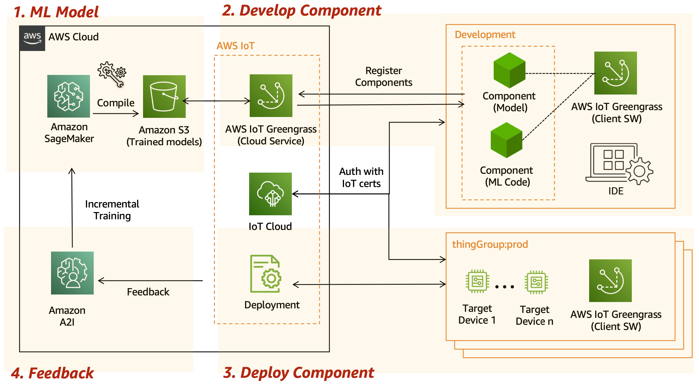

# Model Compilation for multiple on-devices (AIoT)

## Create Compilation Job

단일 타겟 디바이스가 아니라 여러 종류의 타겟 디바이스에 모델을 배포하려면 어떤 방법이 좋을까요? 일일이 수동으로 컴파일해야 할까요?
그렇지 않습니다. SageMaker Neo로 과금 없이 여러 타겟 디바이스들에 적합하게 모델을 컴파일할 수 있습니다.
컴파일된 모델은 엣지 디바이스에서 곧바로 추론하거나, IoT Greengrass와 연동하여 IoT의 스트리밍 데이터를 받아서 추론을 수행할 수도 있습니다.

아래와 같이 `create_compilation_job` API로 동시에 여러 타겟 디바이스들에 적합하게 모델을 컴파일할 수 있습니다.

```python
response = sm_client.create_compilation_job(
    CompilationJobName=[JOB-NAME],
    RoleArn=[ROLE-ARN],
    InputConfig={
        'S3Uri': [YOUR-S3-INPUT-PATH},
        'DataInputConfig': input_shape,
        'Framework’: [YOUR-FRAMEWORK]'
    },
    OutputConfig={
        'S3OutputLocation': [YOUR-S3-OUTPUT-PATH],
        'TargetDevice': [YOUR-DEVICE] 
    },
    StoppingCondition={
        'MaxRuntimeInSeconds': 500
    }
```

## Architecture
AWS IoT Greengrass를 연동하면 백만 단위의 온디바이스에 모델을 한 번에 배포할 수 있습니다.

SageMaker로 모델을 훈련하고 SageMaker Neo로 타겟 디바이스(예: 라즈베리파이, NVIDIA Jetson Nano)에 맞게 컴파일 이후 Amazon S3에 모델을 저장합니다.

그리고, 개발용 디바이스에 IoT greengrass 코어를 설치하고 컴포넌트를 개발 후 클라우드로 등록합니다.

컴포넌트 배포는 여러 개의 디바이스를 `thing group` 으로 묶어서 한 번에 배포하면 편리합니다. 또한, 각 디바이스마다 일일이 보안 인증을 받는 수고를 덜기 위한 fleet 프로비저닝을 활용할 수도 있죠.

배포가 완료되었다면 지속적으로 Greengrass Core를 통해 피드백을 받아서 모델 드리프트 발생시 Amazon A2I를 연동해 모델 재훈련이 가능합니다. 



자세한 내용은 아래 핸즈온을 참조해 주세요.
- https://github.com/aws-samples/aiot-e2e-sagemaker-greengrass-v2-nvidia-jetson