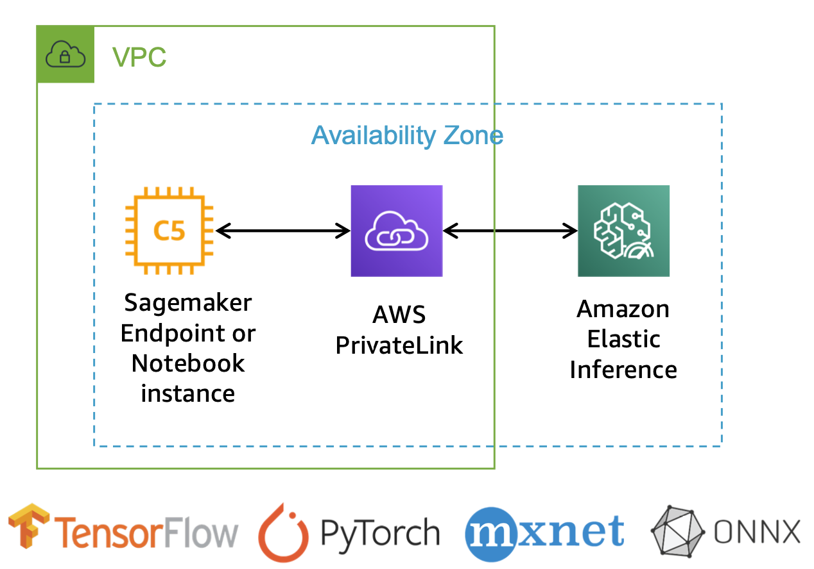

# Elastic Inference

## Overview
비싼 GPU 인스턴스를 배포 용도로 계속 띄워 놓게 되면 많은 비용이 발생할 수밖에 없고, 비용 절감을 위해 CPU 인스턴스를 쓰기에는 충분한 latency를 보장할 수 없습니다. 이럴 때 바로 Elastic Inference Acclerator(이하 EIA)를 사용하시면 됩니다.

EIA는 평소에는 CPU 인스턴스를 사용하다가 추론 시에 GPU 엑셀러레이터를 빌려오는 개념이며, 이를 통해 GPU의 컴퓨팅 파워를 사용하면서 GPU 인스턴스 대비 추론 비용을 최대 75%까지 절감할 수 있습니다. 호스트 인스턴스와 추론 가속 하드웨어를 분리할 수 있는 유연성이 있으므로 애플리케이션에 필요한 CPU, 메모리 및 기타 모든 리소스에 대해 하드웨어를 유연하게 최적화 할 수 있습니다. 

모든 Amazon SageMaker 인스턴스 유형, EC2 인스턴스 유형 또는 Amazon ECS 작업을 지원하며, 대부분의 딥러닝 프레임워크를 지원하고 있습니다. 지원되는 프레임워크 버전은 AWS CLI로 확인할 수 있습니다.



## Elastic Inference 적용 방법

EIA는 이미 AWS에서 각 프레임워크에 적합한 빌트인 컨테이너를 제공하고 있기 때문에, 인스턴스 타입만 `eia`로 지정해 주시면 됩니다. 단, PyTorch를 사용할 경우에는 인스턴스 타입 지정 전에 추가로 코드를 변경해야 하며, PyTorch 1.3.1과 PyTorch 1.5.1에서 EIA를 적용하기 위한 용법이 다르다는 점도 주의해 주세요. 

PyToch에서 저장하는 `.pth` 파일은 weight 가중치만 저장되며, 네트워크 구조를 정의한 그래프는 저장되지 않습니다. 이를 TorchScript 변환을 통해 weight와 graph를 모두 포함하게 해야 합니다. Tracing 방식과 Scripting 방식이 모두 지원되기 때문에 편리한 방식을 선택해서 모델을 `torch.jit.save()` 함수로 저장하시면 됩니다. 

### PyTorch 1.3.1 (Tracing 방식 권장)

#### TorchScript 생성
```python
input_shape = [1, 3, 224, 224]
input = torch.zeros(input_shape).float()
model = torch.jit.trace(model.eval(), input)
torch.jit.save(model, save_dir)
```

#### model_fn()
```python
# Required when using Elastic Inference
with torch.jit.optimized_execution(True, {‘target_device’: ‘eia:0’}):
    traced_model = torch.jit.trace(model, x)
```

#### Deploy
```python
pytorch_model.deploy(...,
    framework_version=‘1.3.1',
    accelerator_type=＇ml.eia2.medium'
)
```

### PyTorch 1.5.1 (Scripting 방식 권장)

#### TorchScript 생성
```python
model = torch.jit.script(model.eval())
torch.jit.save(model, save_dir)
```

#### model_fn()
```python
model = torch.jit.load(save_dir, map_location=torch.device('cpu’))
# Disable profiling executor
torch._C._jit_set_profiling_executor(False)
```

#### Deploy
```python
_ecr_image=“_763104351884.dkr.ecr.<region>.amazonaws.com/pytorch-inference-eia:<image_tag>"
model.deploy(...,
    image_uri=_ecr_image,    
    framework_version='1.5.1', 
    accelerator_type=＇ml.eia2.medium'
)
```
