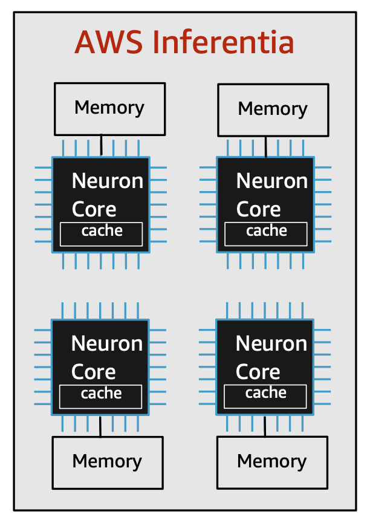

# AWS Inferentia

## Overview
AWS Inferentia는 저렴한 비용으로 높은 처리량(throughput)과 짧은 레이턴시(low latency)의 추론 성능을 제공하기 위해 AWS에서 개발한 머신 러닝 추론 칩입니다. Inferentia 칩은 최신형 커스텀 2세대 Intel® Xeon® 프로세서 및 100Gbps 네트워킹과 결합되어 머신 러닝 추론 애플리케이션을 위한 고성능 및 업계에서 가장 낮은 비용을 제공합니다. AWS Inferentia 기반 Amazon EC2 Inf1 인스턴스는 Inferentia 칩에서 머신 러닝 모델을 컴파일&최적화할 수 있는 AWS Neuron 컴파일러, 런타임 및 프로파일링 도구가 포함되어 있습니다.

AWS Neuron은 AWS Inferentia 칩을 사용하여 머신 러닝 추론을 실행하기 위한 SDK입니다. Neuron을 사용하면 딥러닝 프레임워크(PyTorch, TensorFlow, MXNet)에서 훈련된 컴퓨터 비전 및 자연어 처리 모델을 보다 빠르게 추론할 수 있습니다. 또한, [Dynamic Batching](https://awsdocs-neuron.readthedocs-hosted.com/en/latest/neuron-guide/appnotes/perf/torch-neuron-dataparallel-app-note.html#dynamic-batching-description)과 [Data Parallel](https://awsdocs-neuron.readthedocs-hosted.com/en/latest/neuron-guide/neuron-frameworks/pytorch-neuron/api-torch-neuron-dataparallel-api.html) 같은 기능을 활용하여 대용량 모델에 대한 추론 성능 개선이 가능합니다.

Inf1 인스턴스는 SageMaker 호스팅 인스턴스로도 배포가 가능하며, 여러분은 아래 두 가지 옵션 중 하나를 선택하여 머신 러닝 모델을 쉽고 빠르게 배포할 수 있습니다.

- **Option 1.** SageMaker Neo로 컴파일 후 Inf1 호스팅 인스턴스로 배포. 이 경우 SageMaker Neo에서 내부적으로 Neuron SDK를 사용하여 모델을 컴파일합니다. Hugging Face 모델은 컴파일 시에 dtype int64로 컴파일해야 합니다. 
- **Option 2.** 개발 환경에서 Neuron SDK로 직접 컴파일 후 Inf1 호스팅 인스턴스로 배포 

