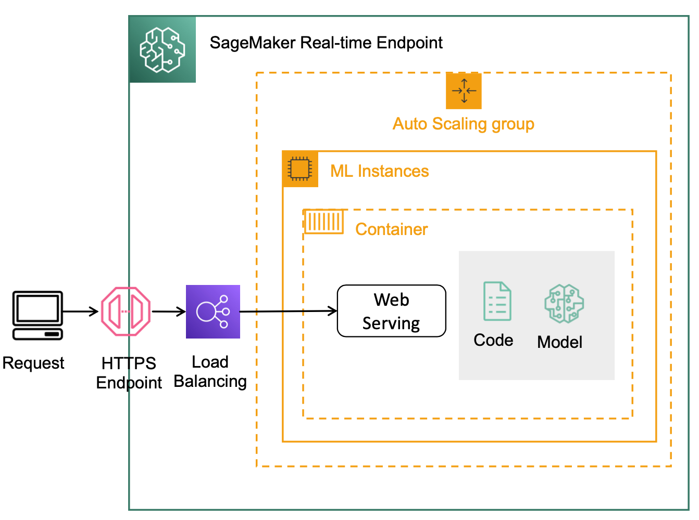

# Real-time Inference

## Overview
SageMaker Endpoint는 REST API를 통해 실시간 추론을 수행할 수 있는 완전 관리형 서비스입니다. 기본적으로 분산 컨테이너로 고가용성, 다중 모델 로딩, A/B 테스트를 위한 인프라 환경(EC2, 로드밸런서, 오토스케일링, 모델 아티팩트 로딩 등)이 사전 구축되어 있기에 몇 줄의 코드만으로 Endpoint가 자동으로 생성되기에, 모델을 프로덕션에 빠르게 배포할 수 있습니다.



## Importing models 

* 사전 훈련된 모델 파일들(예: model weights, model definition 등)을 model.tar.gz로 압축합니다.
* S3 버킷에 모델 아티팩트 model.tar.gz을 업로드합니다.
* SageMaker Model에 모델 아티팩트를 등록합니다.
* SageMaker Endpoint configuration을 통해 엔드포인트 설정을 구성합니다.
* SageMaker API나 AWS 콘솔을 통해 SageMaker 호스팅 job을 수행하여 SageMaker Endpoint를 배포합니다.

## 엔드포인트 생성 3단계

### Create Model
```shell
aws sagemaker create-model 
  --model-name model1
  --primary-container '{"Image": "123.dkr.ecr.amazonaws.com/algo",
                        "ModelDataUrl": "s3://bkt/model1.tar.gz"}'
  --execution-role-arn arn:aws:iam::123:role/me
```

### Create Endpoint Config
```shell
aws sagemaker create-endpoint-config
  --endpoint-config-name model1-config
  --production-variants '{"InitialInstanceCount": 2,
                          "InstanceType": "ml.m4.xlarge",
                          "InitialVariantWeight": 1,
                          "ModelName": "model1",
                          "VariantName": "AllTraffic"}'
```

### Create Endpoint
```shell
aws sagemaker create-endpoint
  --endpoint-name my-endpoint
  --endpoint-config-name model1-config
```