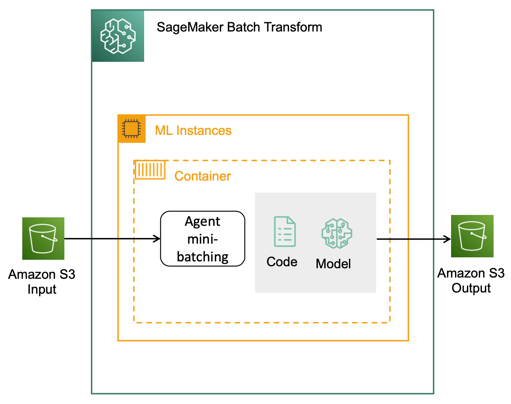

# Batch Transform

## Overview
Latency에 덜 민감한 애플리케이션이나 일정 주기(일단위, 주단위, 월단위 등)로 수행되는 일괄 추론 작업은 SageMaker Batch Transform을 사용하여 비용을 절감하는 것을 권장합니다. 상시 띄워져 있는 엔드포인트와 달리, Batch Transform은 배치 데이터에 대한 추론이 수행되는 순간에만 인스턴스를 사용하기 때문입니다. 이 때, Amazon S3에 저장되는 Batch Transform 출력값들을 Amazon DynamoDB 또는 RDS와 같은 데이터베이스와 연동하여 저장함으로써 대용량의 배치 job을 편리하게 수행할 수 있습니다.

