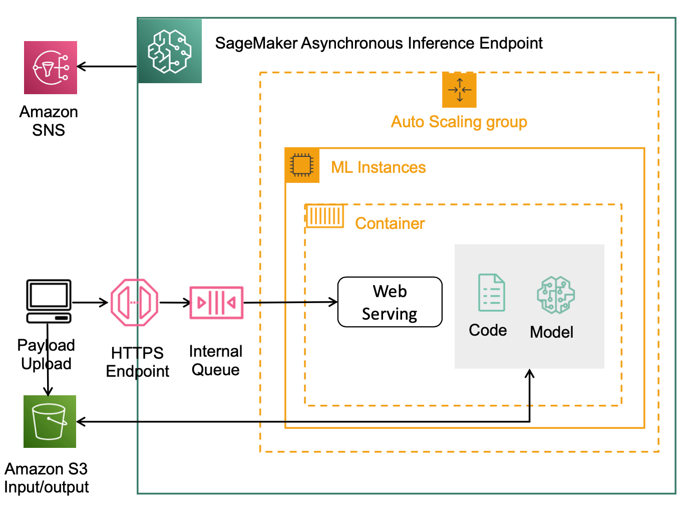

# Asynchronous Inference

## Overview
SageMaker 비동기(asynchronous) 추론 엔드포인트는 처리 시간이 수 분 이상 걸릴 수 있는 대규모 입력 페이로드를 사용하는 유즈케이스에 적합합니다.
AsyncInvokeEndpoint API를 호출하면 Amazon S3에 payload를 배치하고 별도의 관리형 queue에 입력 데이터에 대한 요청을 포인터로 전송합니다. 호스팅 인스턴스는 포인터를 사용하여 payload 데이터를 다운로드하고 추론 컨테이너를 통해 모델 추론 결괏값을 계산하여 S3에 저장합니다. 이 때, 선택적으로 SNS를 통해 추론이 완료되었다는 알림을 받을 수 있습니다. 

