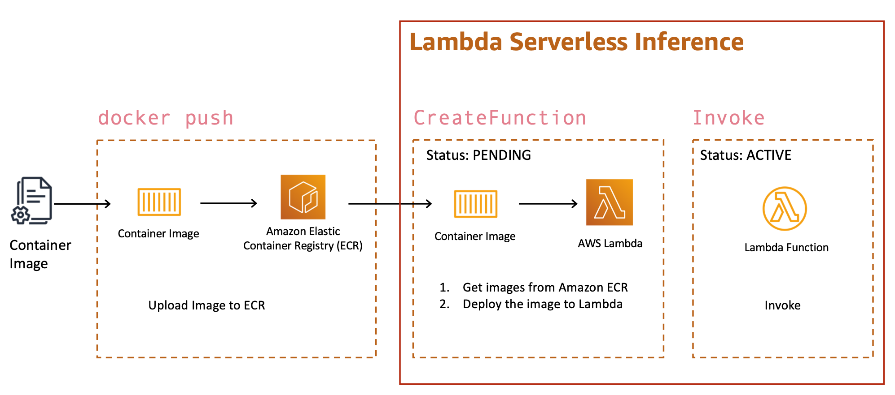

# Lambda Serverless Inference

## Overview
re:Invent 2020에 소개된 Lambda 컨테이너 기능 지원으로 기존 Lambda에서 수행하기 어려웠던 대용량 머신 모델에 대한 추론을 보다 수월하게 실행할 수 있게 되었습니다. Lambda 컨테이너 이미지를 Amazon ECR(Amazon Elastic Container Registry)에 푸시하였다면 Lambda 함수를 생성하여 직접 컨테이너 이미지를 배포하거나 SageMaker의 API 호출로 Serverless endpoint를 쉽게 배포할 수 있습니다.
  
