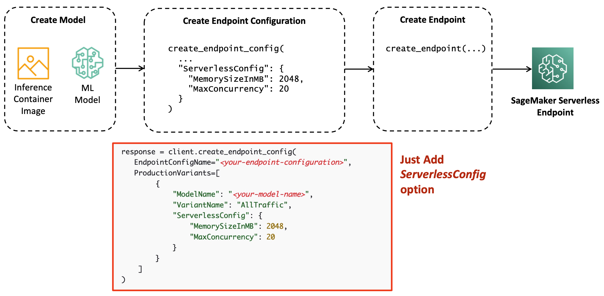

# SageMaker Serverless Inference

## Overview
Amazon SageMaker Serverless Inference는 re:Invent 2021에 런칭된 신규 추론 옵션으로 호스팅 인프라 관리에 대한 부담 없이 머신 러닝을 모델을 쉽게 배포하고 확장할 수 있도록 제작된 신규 추론 옵션입니다. SageMaker Serverless Inference는 컴퓨팅 리소스를 자동으로 시작하고 트래픽에 따라 자동으로 스케일 인/아웃을 수행하므로 인스턴스 유형을 선택하거나 스케일링 정책을 관리할 필요가 없습니다. 따라서, 트래픽 급증 사이에 유휴 기간이 있고 콜드 스타트를 허용할 수 있는 워크로드에 이상적입니다.

