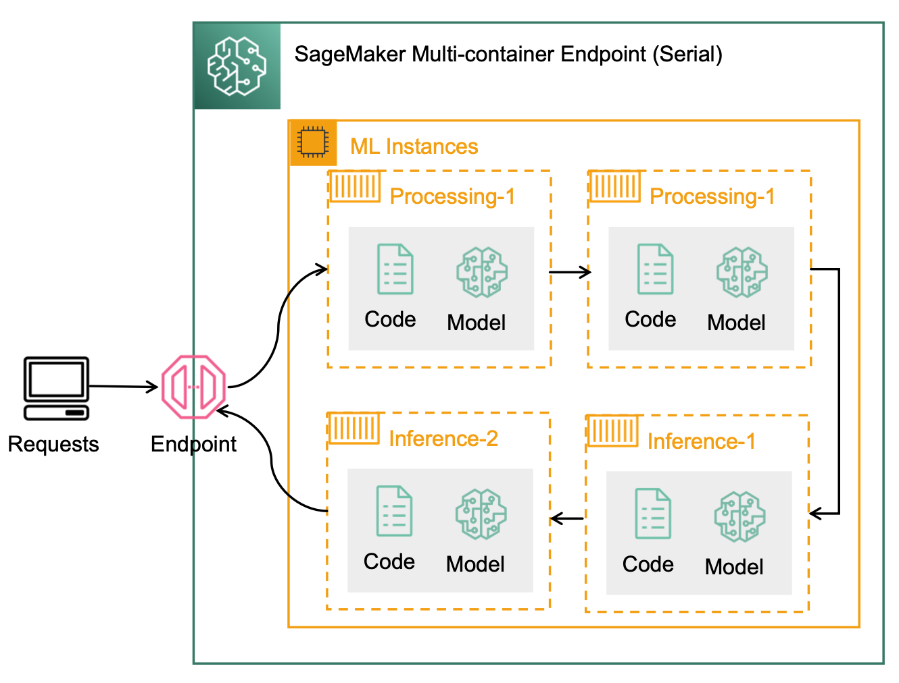

# Multi-container Endpoint

## Overview
SageMaker 멀티 컨테이너 엔드포인트를 사용하면 서로 다른 serving 스택(예: 모델 서버, 머신 러닝 프레임워크, 프레임워크 버전, 알고리즘 등)에 구축된 여러 추론 컨테이너를 하나의 엔드포인트에서 실행하고 독립적으로 각 추론 컨테이너를 호출할 수 있습니다. 

- 인스턴스의 전체 수용량을 포화시킬 정도의 트래픽이 없는 경우에 여러 모델(예: Object Detection, Named Entity Recognition)을 서빙
- A/B 테스트와 같은 시나리오에서 서로 다른 프레임워크 버전(예: TensorFlow 1.x vs. TensorFlow 2.x)에서 실행되는 유사한 아키텍처의 비교
- 
