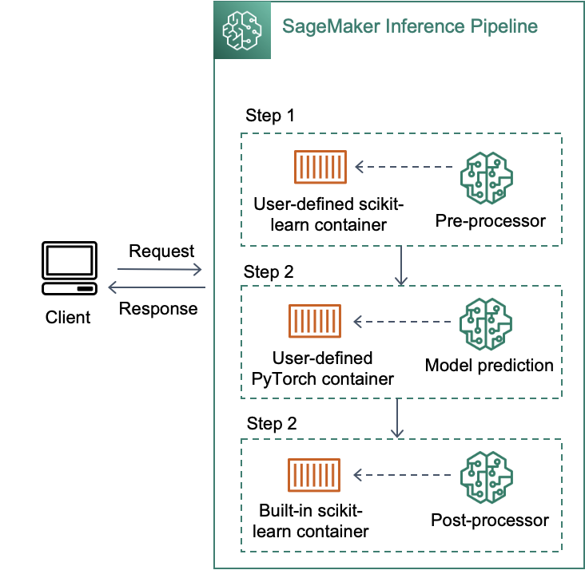

# Inference pipeline (a sequence of up to 5 models)

## Overview
추론 파이프라인은 단일 엔드포인트(single endpoint)에 2~5개 컨테이너(빌트인 컨테이너 or 사용자 정의 컨테이너)의 시퀀스를 단계(step)별로 연결합니다. 각 단계의 응답은 다음 단계의 추론 요청으로 사용되며, 이를 활용하여 PyTorch/TensorFlow/MXNet/scikit-learn/Spark ML 등의 다양한 프레임워크에 대한 모델 앙상블을 배포하거나 모델 전처리-추론-후처리 과정을 컨테이너로 분리하여 관리할 수 있습니다. BERT 모델을 배포하는 대표적인 예시를 들어 보겠습니다.

* (1: 사용자 정의 scikit-learn 컨테이너에서 사용자의 요청 및 context에 대한 전처리 수행
* (2): (1)의 output을 입력으로 받아 빌트인 PyTorch 컨테이너에서 BERT 모델 추론 수행
* (3): (2)의 output을 입력으로 받아 빌트인 scikit-learn 컨테이너에서 응답 데이터 생성을 위한 후처리 수행

