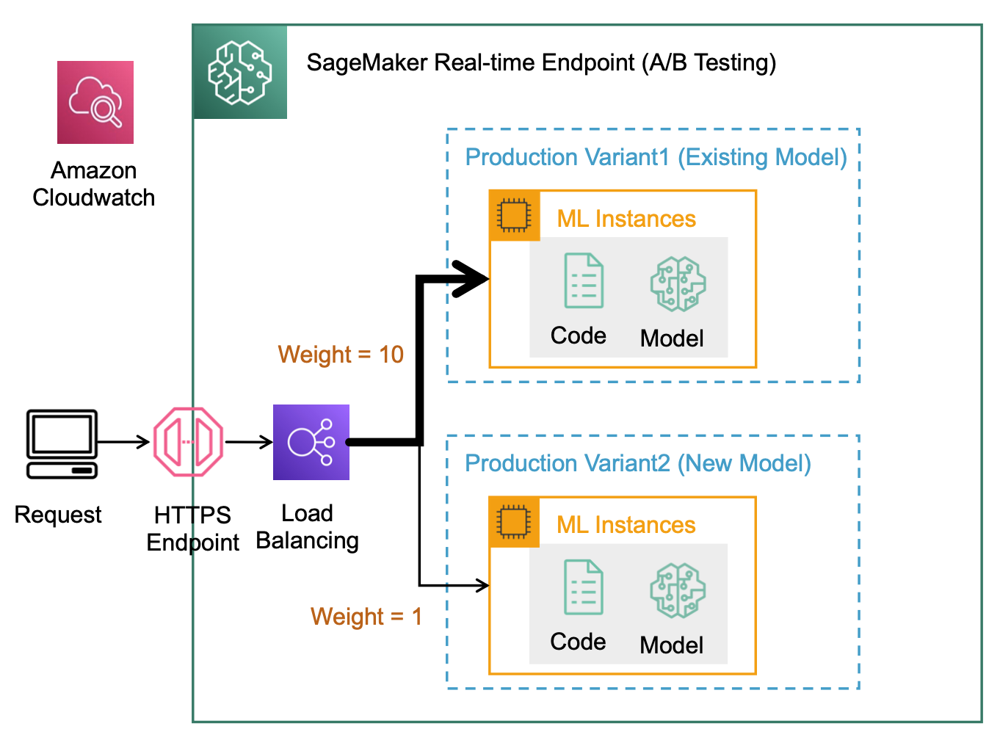

# A/B Testing

## Overview
프로덕션 ML 워크플로에서 데이터 과학자와 머신 러닝 엔지니어는 데이터/모델/컨셉 드리프트에 따른 재훈련, 하이퍼파라메터 튜닝, 피쳐 선택 등과 같은 다양한 방법들을 통해 모델을 개선합니다. 이 때 이전 모델과 신규 모델 간의 A/B 테스트를 수행함으로써, 신규 모델에 대한 검증을 충분히 해야겠죠. 그렇다면 A/B 테스트를 위해 엔드포인트를 재배포하거나 2개의 엔드포인트를 배포해야 할까요? 그렇지 않습니다. 프로덕션 Variant 기능을 사용하면, 각 variant에 대해 동일한 엔드포인트 뒤에서 여러 모델 또는 모델 버전을 테스트할 수 있습니다.

## Production Variant
SageMaker 엔드포인트에 연결된 로드밸런서는 Endpoint에서 추론 트래픽을 분할하여 여러 모델들로 라우팅하여 AB 테스트를 수행하는 기능을 제공하고 있습니다. 이를 프로덕션 variant라고 하며, 단일 SageMaker Endpoint에서 여러 모델들을 테스트하고 배포할 수 있습니다. 예를 들어, 카나리 롤아웃(canary rollout) 및 블루/그린 배포(blue/green deployment)를 위해 엔드포인트의 모델 간에 트래픽을 이동할 수 있습니다. 물론, 초당 요청 수(requests per second)과 같은 지표를 기반으로 엔드포인트를 자동으로 확장하거나 축소하도록 오토스케일링 policy를 구성할 수도 있습니다.

본 실습에서는 아래와 같은 기능들을 체험해 봅니다.
- 2개의 프로덕션 variant들을 배포 (Variant1: CPU, Variant2: GPU)
- 트래픽 분포 변경 (50:50 -> 80:20 -> 100:0)
- Variant2 삭제
