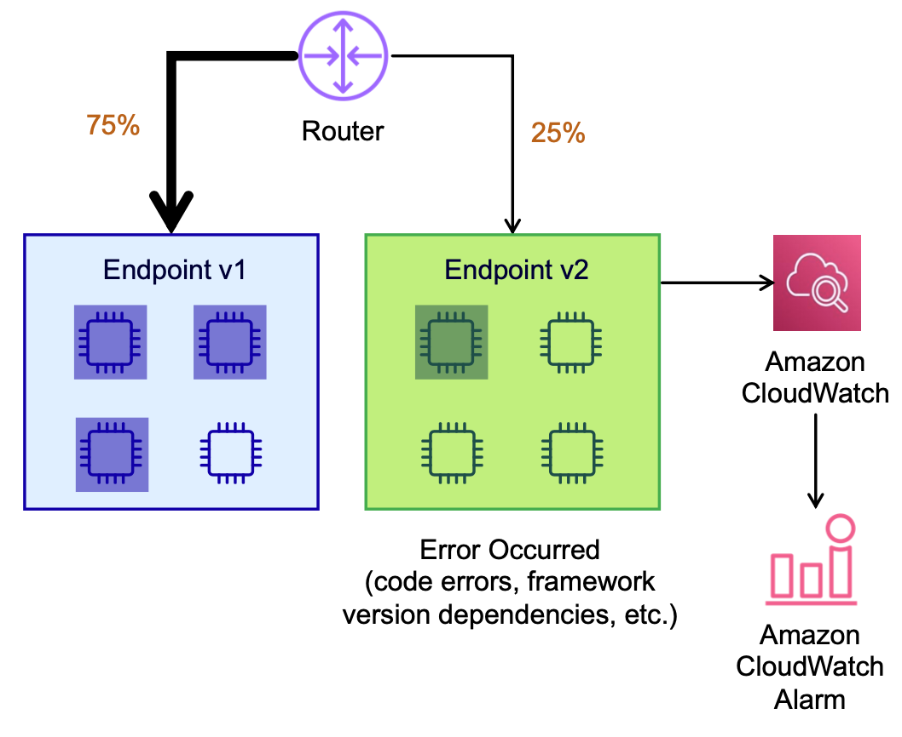
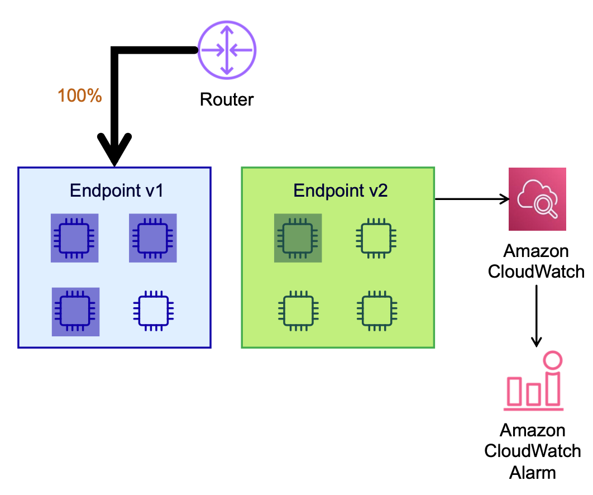

# Blue/Green Deployment Guardrail

## Overview
SageMaker 배포 가드레일(Deployment Guardrail)은 프로덕션 환경에서 현재 모델에서 새 모델로 안전하게 업데이트하기 위한 완전 관리형 블루/그린(Blue/Green) 배포 가드레일 서비스입니다. 카나리(Canary) 및 선형(Linear)과 같은 트래픽 전환 모드를 사용하여 업데이트 과정에서 현재 모델에서 새 모델로 트래픽 전환 프로세스를 세부적으로 제어할 수 있습니다. 또한 문제를 조기에 포착하고 프로덕션에 영향을 미치지 않게 자동 롤백과 같은 보호 기능을 제공합니다.

