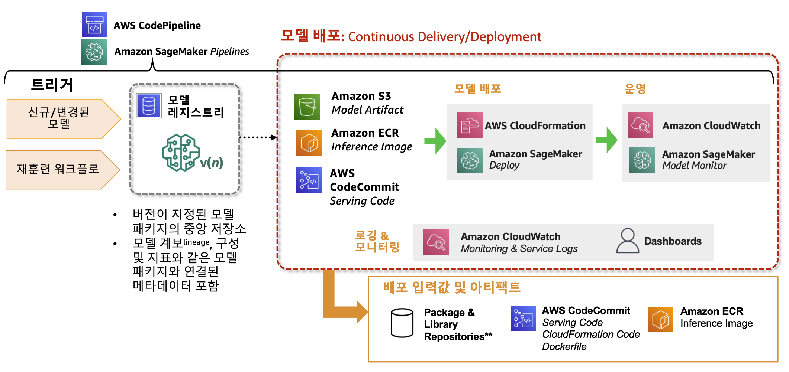

# End-to-end ML pipelines

## Overview
SageMaker Pipelines은 ML 파이프라인과 CI/CD 파이프라인을 쉽고 편리하게 수행할 수 있는 관리형 서비스입니다. re:Invent 2020 서비스 런칭 이후 t신규 기능들이 지속적으로 업데이트되고 있으며, 특히 2021년 8월 업데이트된 주요 기능인 Lambda Step을 사용하면 호스팅 엔드포인트 모델 배포를 비롯한 서버리스 작업들을 쉽게 수행할 수 있습니다. 또한 캐싱(caching) 기능을 사용하면 모든 파이프라인을 처음부터 재시작할 필요 없이 변경된 파라메터에 대해서만 빠르게 실험해볼 수 있습니다.

